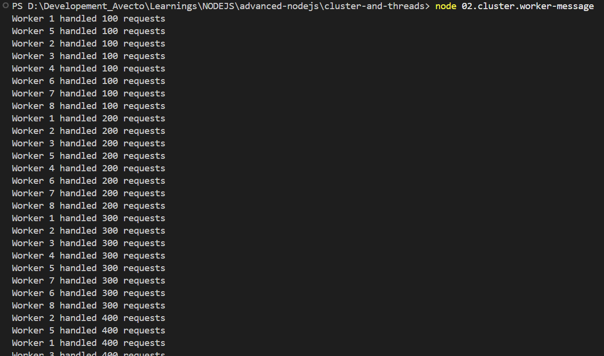

# Clusters, Threads and Child Process:

The three columns encode the decision:

1. cluster for spreading I/O-bound HTTP servers across cores,
2. worker_threads for running CPU-heavy JavaScript in parallel,
3. child_process for talking to anything outside Node.

## Terminalogies

1. IPC Messages -> Inter Process Communication

## Clusters:

cluster — spreading an HTTP server across all CPU cores <br>.

The cluster module forks your Node process once per CPU core. Each worker is a full OS process running the same code, and the OS automatically load-balances incoming connections across all of them. Zero changes to your request handling logic.

### How to perform IPC communications

```js
process.on('message', () => {});
```

**Implementation**:

1. The Primary process manages workers and distributes incoming connections.
2. Workers can send messages back to the primary using `process.send()`, and the primary can listen for these using `worker.on('message', ...)`.

### To Test

```bash
npx autocannon -c 100 -d 3 http://localhost:3000

# This will spawn 100 separate simultaneou connection to hit the server with max amount of request for 3 seconds
```

### Code Flow of 02.cluster-worker.message

#### Primary to Workers

1. Inside the Primary process, a global clock (setInterval) fires precisely every 10,000 milliseconds.
2. The primary process steps into the broadcast() function.It loops through its internal directory of active workers (cluster.workers).
3. It calls `worker.send({ type: 'config', rateLimit: 100 })`.
4. This stringifies the JavaScript object into JSON data and pushes it into the IPC pipeline.
5. The Operating System delivers this data package down to each individual worker process.
6. Inside the Worker process, the active listener `process.on('message', ...)` detects the arrival of the package, parses it back into a JavaScript object, evaluates msg.type === 'config', and outputs the text line to your terminal console.

#### Client -> Primary -> Workers

1. An external client (like curl or autocannon) targets your machine by sending an HTTP payload to http://localhost:3000.
2. The Primary process holds the master network socket on Port 3000 but _doesn't handle the data_.
3. It hands the raw network connection down to an available worker process.
4. The selected Worker process receives the connection, increments its local context variable `(requests++)`, and generates a quick HTTP text response `(res.end('ok'))` directly back over the internet to the client.
5. If that specific worker's requests count perfectly divides by 100 (requests % 100 === 0), it halts for a microsecond to execute `process.send({ type: 'metrics', requests })`.
6. The worker pushes this metric payload upward through the IPC pipeline.
7. The Primary process detects the arriving data payload via its active tracking listener `(worker.on('message', ...))`.
8. The Primary process reads the incoming argument package and triggers a console log stating exactly which child process ID achieved the target count.

#### Output of the 02.cluster-worker.message


